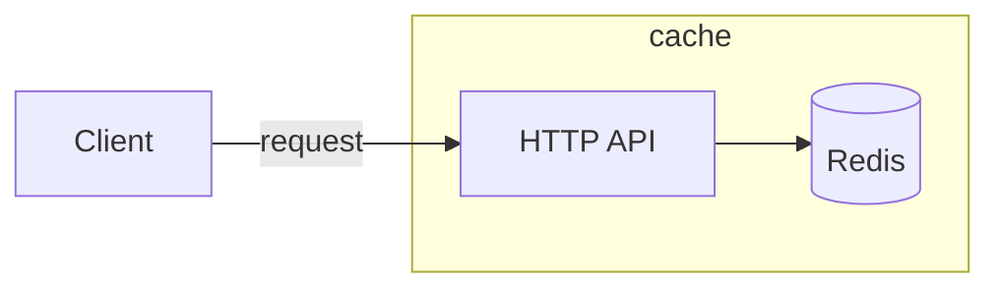

[](https://github.com/eclipse-xfsc/redis-cache-service/-/commits/main)
[](https://github.com/eclipse-xfsc/redis-cache-service/-/commits/main)

# Cache service

Cache service exposes HTTP interface for working with Redis.

It is developed using the [Goa v3](https://goa.design/) framework.

> A helper script named `goagen.sh` can be found inside the root directory of
> the service. It can be used to generate the transport layer code from the
> Goa DSL definitions in the [design](./design) directory. The script should
> be executed everytime the design definitions are updated. It also generates
> updated OpenAPI documentation from the DSL.

Generation: ```
go install goa.design/goa/v3/cmd/goa@v3.20.1
goa gen github.com/eclipse-xfsc/redis-cache-service
```

### Basic Architecture



### Configuration

The cache service is configured using the [Configuration File](./internal/config/config.go).
All configurations are expected as Environment variables specified in the
configuration file. For managing the configuration data from ENV variables,
[envconfig library](https://github.com/kelseyhightower/envconfig) is used.

### API Documentation

[OpenAPI Swagger Documentation](https://github.com/eclipse-xfsc/redis-cache-service/-/blob/main/gen/http/openapi3.json). In the local docker-compose
environment, the Swagger URL is available at http://localhost:8083/swagger-ui.

### Events

The Cache service publishes events to a message broker using the [CloudEvents
specification](https://cloudevents.io/). Current implementation uses [NATS](https://nats.io)
as message broker and uses [cloudevents-go library](https://github.com/cloudevents/sdk-go)
as a client to publish events.

The structure of the `Data` event field is defined in the events [client](./internal/events/client.go). 

### Build

##### Local binary
To make the service binary locally, you can run the following command from the root
directory (you must have [Go](https://go.dev/) installed):
```shell
go build -o task ./cmd/task/...
```

##### Docker image

You can see the Dockerfile of the service under the [deployment](./deployment) directory.
There is one Dockerfile for use during local development with [docker-compose](./deployment/compose/Dockerfile) and one for
building an optimized production image: [deployment/docker/Dockerfile](./deployment/docker/Dockerfile).

### Versioning

There is one global exported variable named `Version` in `main.go`. The variable is set
to the latest tag or commit hash during the build process. You can look in the production
Dockerfile to see how the Version is set during build. The version is printed in the service
log on startup and can be used to verify which specific commit of the code is deployed.

> Version should *not* be set or modified manually in the source code.

### Logging

The service outputs all logs to `stdout` as defined by the best practices in the Cloud Native
community. See here for more details [12 Factor App](https://12factor.net/logs).
From there logs could be processed as needed in the specific running environment.
The standard log levels are `[debug,info,warn,error,fatal`] and `info` is the default level.
If you want to set another log level, use the ENV configuration variable `LOG_LEVEL` to set it.

### Dependencies

There must be a running instance of [Redis](https://redis.io/) visible to the service.
The address, username and password of Redis must be provided as environment variables.

Example:
```
REDIS_ADDR="localhost:6379"
REDIS_USER="user"
REDIS_PASS="pass"
```

### Development

This service uses [Goa framework](https://goa.design/) v3 as a backbone. 
[This](https://goa.design/learn/getting-started/) is a good starting point for learning to use the framework.

### Dependencies and Vendor

The project uses Go modules for managing dependencies, and we commit the `vendor` directory.
When you add/change dependencies, be sure to clean and update the `vendor` directory before
submitting your Merge Request for review.
```shell
go mod tidy
go mod vendor
```

### Tests and Linters

To execute the units tests for the service go to the root project directory and run:
```go
go test -race ./...
```

To run the linters go to the root project directory and run:
```go
golangci-lint run
```

## GDPR

[GDPR](GDPR.md)

## Dependencies

[Dependencies](go.mod)

## Deployment

### Helm

[Helm deployment documentation](deployment/helm/README.md)

## License

[Apache 2.0 license](LICENSE)
